# Client usage tutorial

## Start application

When you first start the app, it asks for permission to send notifications.

  

This permission must be allowed because alerts sent to the server are propagated to the "chief" and nearby users who are notifiable (device registered to accept notifications), so this permission is essential, not only to receive notifications, but also to technically be included in an alert. Click on "Allow".

The general information page will open. Read it carefully, as it contains useful details on how the system works and what you need to do to use it.

At the bottom of the page, you can click on "Legal Terms": this will open a page containing the terms and conditions of use, which you will need to accept after reading it.

NOTE: The same page can be reached by clicking on the menu at the top left.

  

After accepting the legal terms, the login page will open. To log in, you must be registered (have an account on the server), so click on the "Don't have an account? Sign up" link.

## Registration

Registration has one requirement, as explained on the "Info" page: the user's email address must have been authorized by the administrator or by the "officer" user, i.e. it must have been included in a white list, so make sure you have obtained this authorization.

Registration is simple: simply fill out the short form (first name, last name, email address, password). You must set a strong password, containing at least one uppercase character, one lowercase character, a symbol, and a number, and it must be sufficiently long.

  

Once you confirm your registration, an activation link will be sent to your email inbox. You must open the email and click on the activation link to complete the registration, so your account will be activated and you can do login.

NOTE: the activation link received by email expires after 24 hours. After this time, you will need to reopen the registration page, fill out the form again, and receive a new activation link.

## Login and 2FA

The login page can be reached from the "Info" page or from the menu (top left button).

You must enter the email address and password you chose during registration. The password can be clearly displayed as you type it for your convenience by enabling the appropriate checkbox.

  

Click Login. This will open another page titled "2FA" where you'll need to enter the verification code that will be sent to you shortly via email. Don't worry: this verification code is valid for 10 minutes, so you have plenty of time to open the email, read the code (or write it down on a piece of paper if you're comfortable doing so), and then enter it on the "2FA" verification page.

  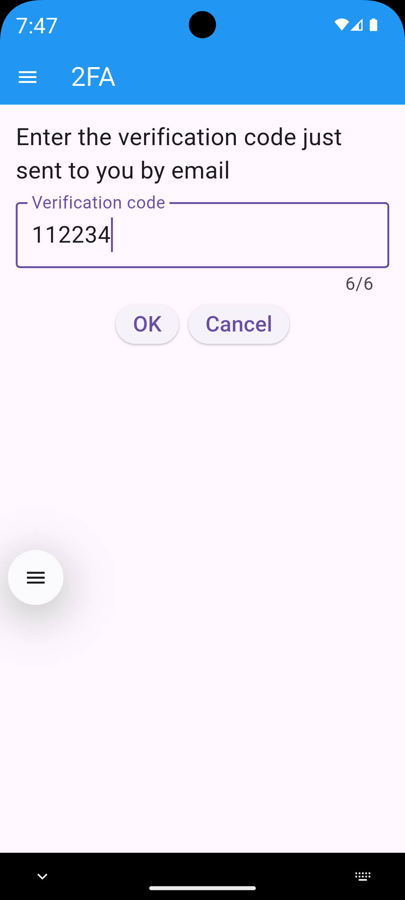

Be careful, though, because you can't enter the verification code incorrectly more than three times, otherwise the login process will be blocked for 24 hours, and you'll have to try again the following day.

NOTE: the login procedure needs to be done only once, after which the system remembers the user's session for a long time.

## Grant geolocalization permissions

Now, be careful: immediately after logging in, a warning window will open, explaining that for the geolocation system to function properly, you must grant it the following permissions:
- precise GPS location
- allow physical activity
- allow all the time
- "unrestricted" battery

NOTE: the following procedure is simple but a bit tedious. Don't worry, though, because you only need to do it the first time, if completed correctly.

### Grant precise GPS location

  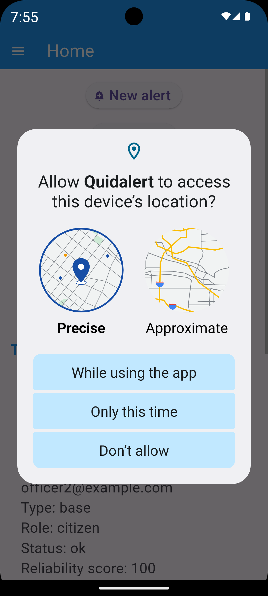

Click on "Always" (if displayed) or click on "While using the app".

### Allow physical activity

  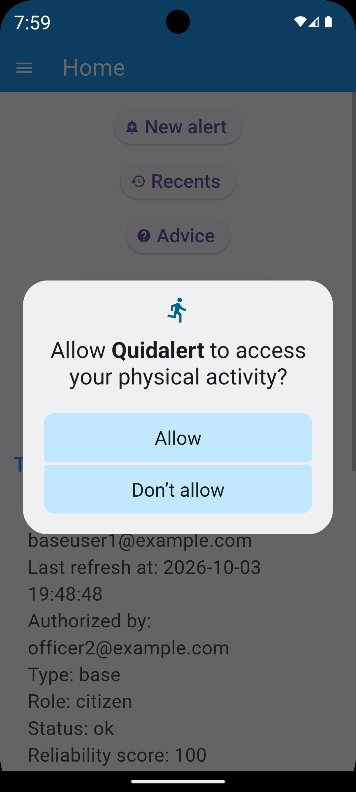

Allow physical activity (motion tracking): click on "Allow".

### Allow background GPS

To be notified about nearby alerts at any time, the device needs to periodically detect the user's GPS location in the background, even when the application has been closed, so you need to allow background GPS location detection by clicking on "Allow all the time".

  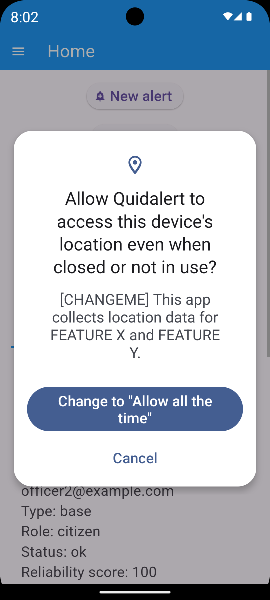

...and then in the settings page that opens automatically, you will still need to switch to "allow all the time". Then, after you are sure, you can click the "back" button on the top left to return to the app.

  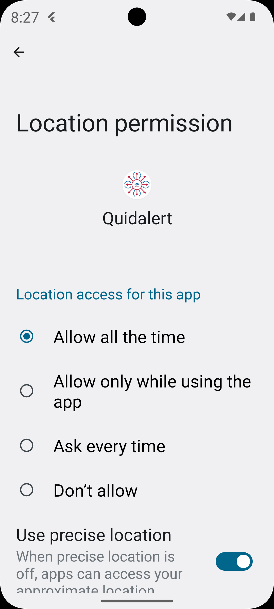

Now the device will automatically detect your GPS location occasionally, typically only when you've moved significantly (250 meters on foot, or a few kilometers or more when driving at car speeds) or when you experience a change in motion (movement followed by stationary, e.g., "I go to a café and sit at a table"), thus minimizing device battery consumption.

However, to ensure this background process isn't interrupted by the device power management mechanism, you should set the battery to "Unrestricted" in the "Battery" section of the system settings relative to Quidalert app. See the following section.

### Battery unrestricted

Click OK in the warning window that explains the "unrestricted" battery function.

The operating system settings page, specific to the Quidalert app, will now open.

  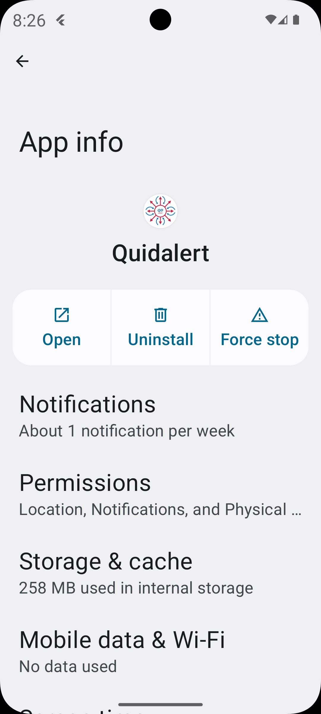

Scroll down slightly and you'll find the "Battery" or "App Battery Usage" option.

  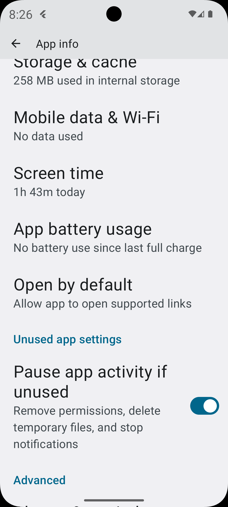

Click to "Battery" or "App battery usage", and then switch to "Unrestricted"

  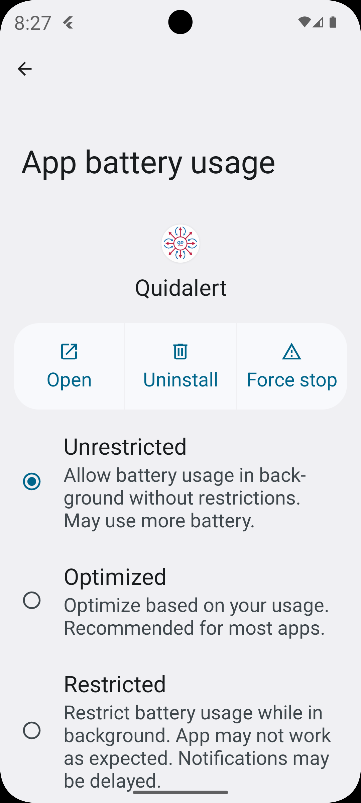

Now you can go back by clicking on the "back" button in the top left corner, and then on the "back" button again until you return to the Quidalert app home page.

NOTE: if you want to check the permissions granted, or if you forget to grant any of the permissions just discussed, don't worry. You can fix this by going to the system settings for the Quidalert app (settings -> apps -> Quidalert) and manually changing the various permissions (notifications, authorizations->locations, autorizations->physical activity, "battery").  
Furthermore, if the system detects that permissions are missing, it presents the user with the same screens seen a moment ago, giving them the opportunity to set the correct permissions.

## Home page

This is the Quidalert home page

  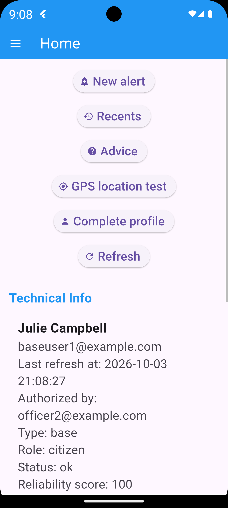

## Advice page

Remember to read the tips page (Quidalert home page, "Advice" button). It's very helpful, and contains important info regarding the session maintenance, the technical functioning of the geolocation system, and other information regarding alerts.

## Complete profile

The profile completion page is important to give rescue leaders (chiefs) the ability to view your personal details and phone number in case you send an alert or are involved as an alerted user.

Alerted basic users cannot see the personal details of the users involved in an alert: they only see the first and last name of the alert sender.

## GPS location test

Useful for verifying the correct functioning of the GPS location detection system.

  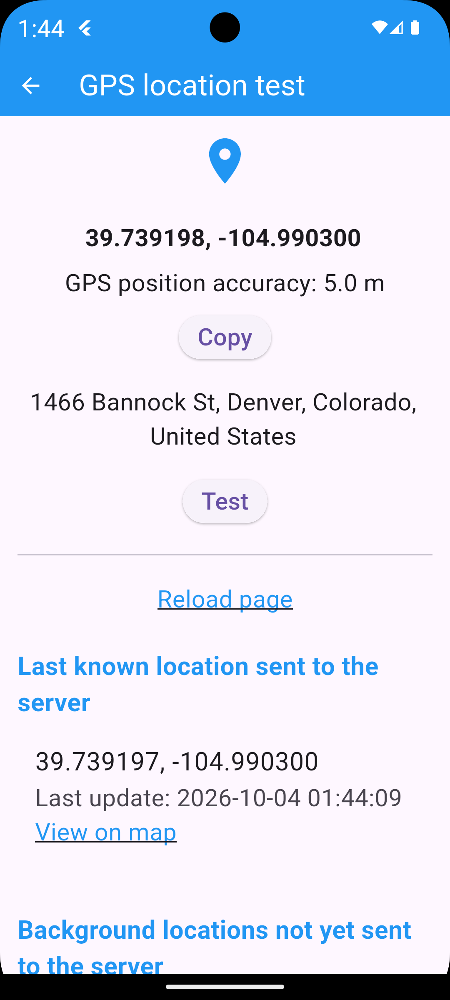

On the same page, we also have the device's latest GPS location sent to the server in the background.

Interesting note: the GPS location detected by this test will be sent to the server, ensuring the server has a new, updated GPS location (especially useful for "chief" users, if their device remains stationary for a long time without detecting new background locations to send to the server). Remember that the server deletes users' GPS locations that are older than a week, and in order to be alerted, users and chiefs must have a recent known GPS location stored on the server.  
Simply put, the test button can be used to perform a GPS check, or it can be used to refresh the user's GPS location on the server.

At the bottom of the page, there's also a list of locations detected by the device in the background, but not yet sent to the server (perhaps due to internet issues). The device will automatically send them as soon as internet is available again, but you can force the upload manually. The server will only store the most recent location.

## Create an alert

Creating an alert is easy. Just go to "New Alert" and enter a description. The device will calculate the current GPS location and send it to the server (it also works indoors, using nearby Wi-Fi or cell tower signals instead of satellite signals).

  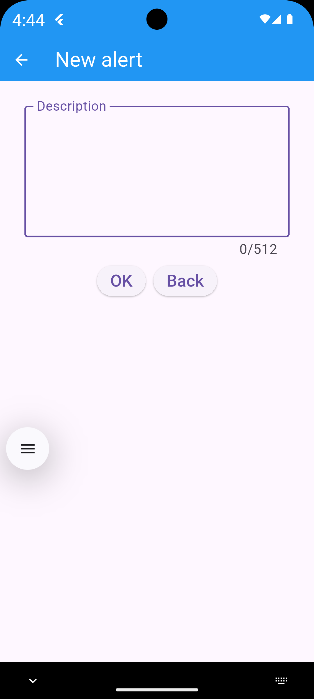

NOTE: if an alert with a similar description is sent within an hour from the last alert and within the same radius, it will be ignored and the user will immediately receive an error message.

NOTE FOR CHIEFS: Chief users can send regular alerts like other users, but they can also send "managed" alerts (the GPS location is customized) and global alerts (general alerts visible to all users within the server's scope). They can also create "empty" alerts (without alerted users), ready to be expanded later with a large radius. If the user is a "chief", a special selector will be shown to choose the alert type.

  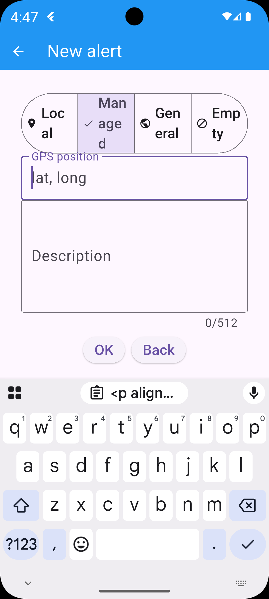

A NOTE ABOUT THE NUMBER OF ALERTED USERS

For efficiency reasons, the server propagates the alert to a maximum of 1000 nearby users. This applies to both the creation of an alert and the expansion function.

The system allows the rescue leader (chief) to perform 3 expansions, so, if we want to do a calculation: the maximum number of alerted users, for a given alert, is 4000 (1000 during creation, and then 1000 for each of the three expansions), 4001 if we include the chief in the calculation.

## Alert details

### Alert details from the perspective of the sender

This is the details page for an alert. We can see the GPS location of the user who issued the alert, their address, and by clicking on the map, we can view the GPS location in the device's built-in Maps app.

  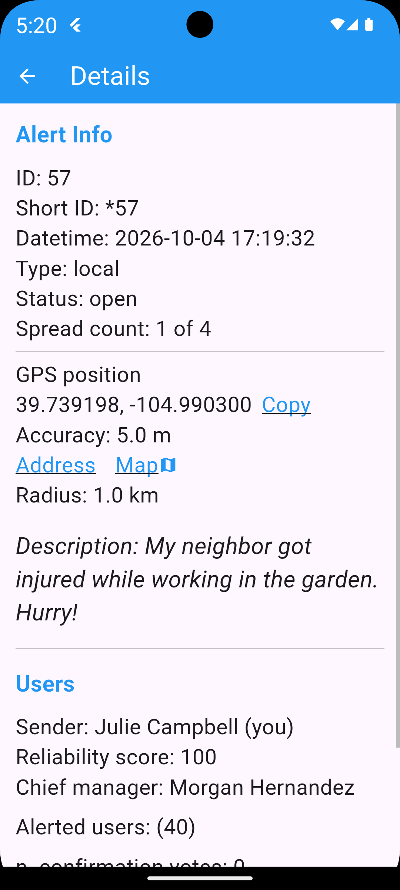

The data regarding the accuracy of the GPS position is interesting, so nearby users and the chief of the rescue team can get an idea of ​​the accuracy of the displayed GPS position, and perhaps the chief can ask the sender of the alert for clarification via message directly in the alert chat.

There's also other useful data (name of the alert sender, name of the alerted leader, and number of alerted users).

Then we see that there's also a chat feature, thanks to which the sender and the alert leader can write messages, and nearby alerted users can read them.

### Alert details from the perspective of nearby users

Nearby users see a page almost identical to this one. They have the option to vote on the alert (confirm, deny, or remain neutral).

  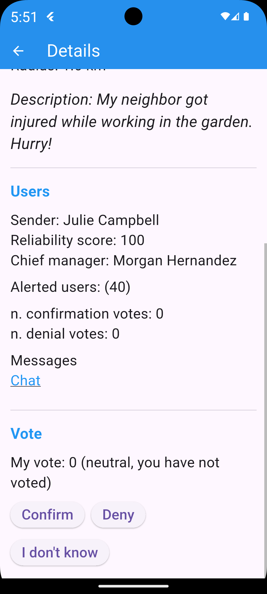

Votes must be carefully considered, because when the chief closes the alert, they can also confirm or deny it. If the alert is confirmed by the chief, the system will reward all users who confirmed it (including the alert sender) and penalize those who denied it. Conversely, if the alert is denied by the chief, the system will reward users who denied it and penalize those who confirmed it (also penalizing the alert sender).

The penalty consists of a reduction in the reliability score. Users with a low score will be able to issue alerts with a more limited radius, and if the score drops to zero, or negative, they will not be able to issue alerts.

After a few months, the reliability score slowly starts to increase again.

### Alert details from the perspective of the chief

Obviously, the manager, having more permissions, can see more details about an alert. 

  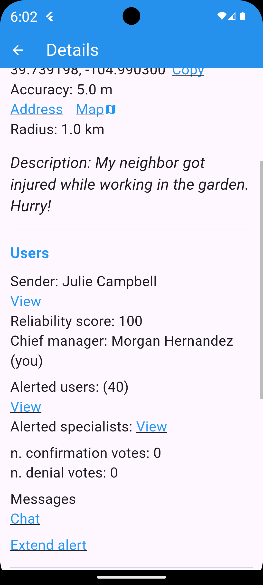

He can see the address and phone number of the alert sender, the list of alerted users sorted by distance

  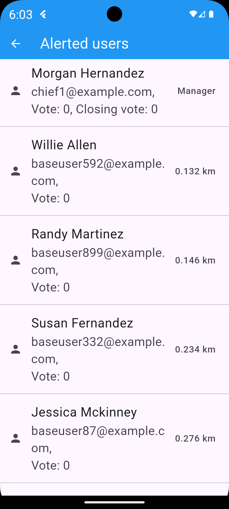

...and the list of alerted specialists (doctors, firefighters, military personnel, police officers, volunteers, etc.). He can also see the contact information (address, phone number) for these individuals.

  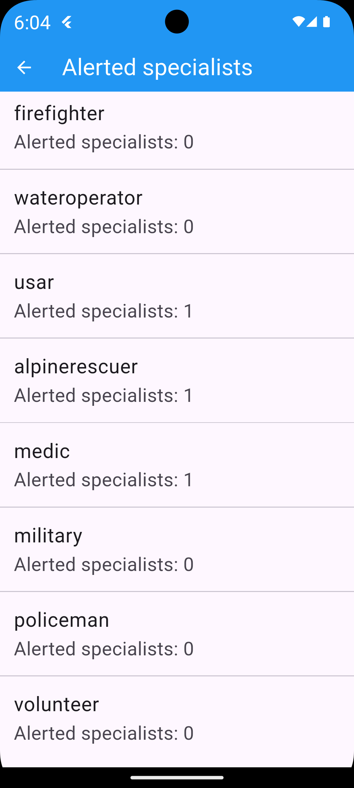

  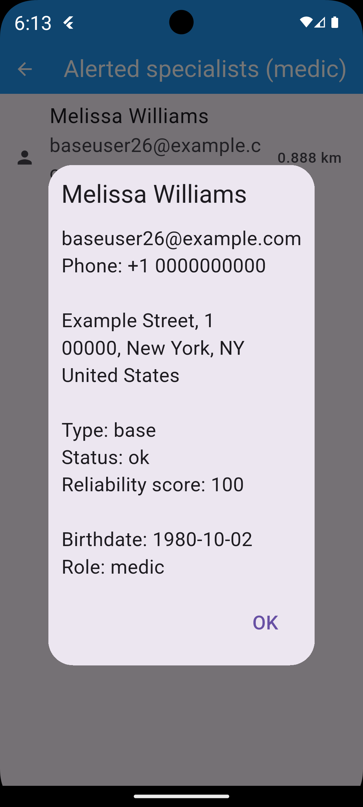

The manager can vote on the alert like a normal user, but the most important action is closing the alert. This can be a neutral, affirmative, denial, or punitive closure. A neutral closure does not affect the reliability scores of the voting users or the alert sender. Other closures do, as we saw earlier. A punitive closure is like a denial closure, but is much more punitive (the alert description is banned as it is considered seriously false, and the sender's reliability score is directly reduced to zero, while the reliability scores of alerted users who voted in favor of the fake alert are significantly reduced).

  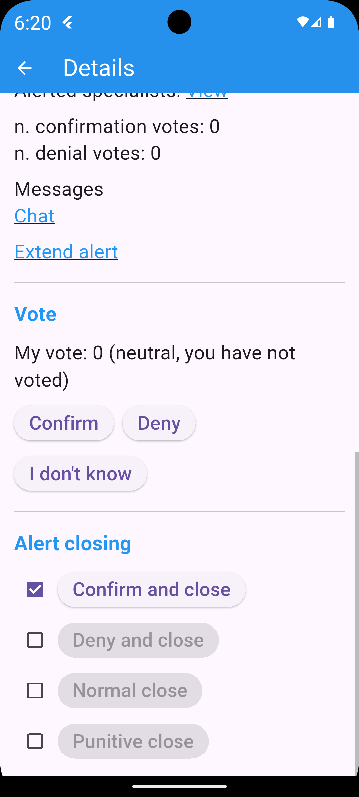

NOTE: the alert close buttons have a safety checkbox, to prevent you from accidentally clicking and closing the alert unintentionally.

## Alert extension

The manager can expand the alert beyond the kilometer (for example 30 kilometers or even more), warning normal users, or focusing on a certain role (for example if you want to warn all "medics" within a 30 kilometer radius).

  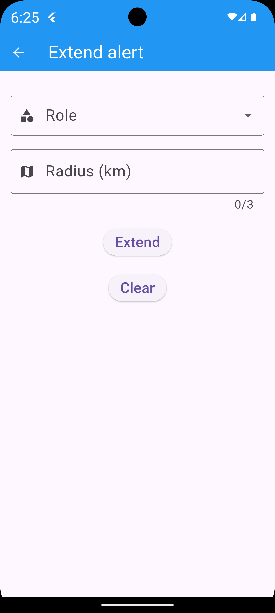

An alert can be expanded multiple times (for example, I could extend the alert to all medics within a 30-kilometer radius, and after that repeat the same operation, extending the alert to all police officers within a 100-kilometer radius).

The maximum number of possible expansions is 3.

## Chat

The chat is very useful: if the alert sender forgets to write something in the alert description, they can write it later in the chat. The rescue manager can respond to reassure the sender and the alerted users and give instructions that are visible to all of them.

  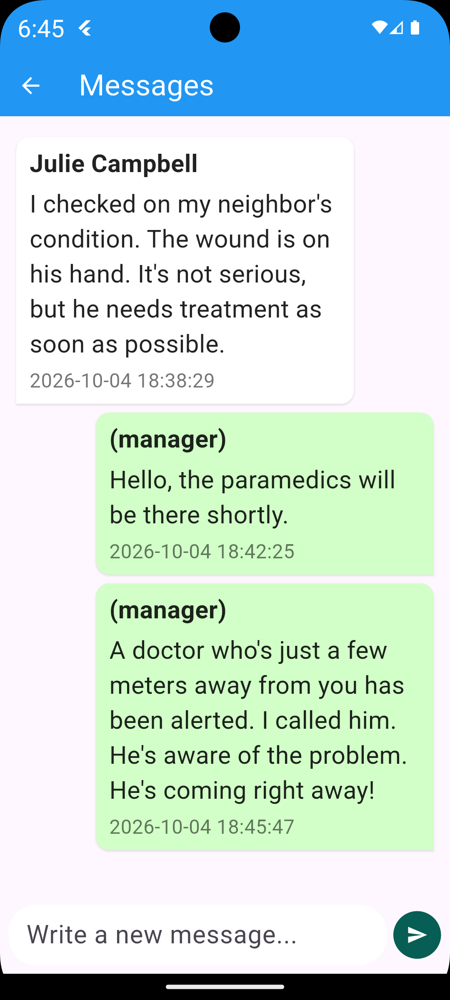

## Recent alerts

On the "recents" page, you can see general alerts, as these are by nature visible to everyone, and then **only alerts in which the user is involved** in some way (as alerted "chief" manager, as an alerted nearby user, or as an alert sender).

  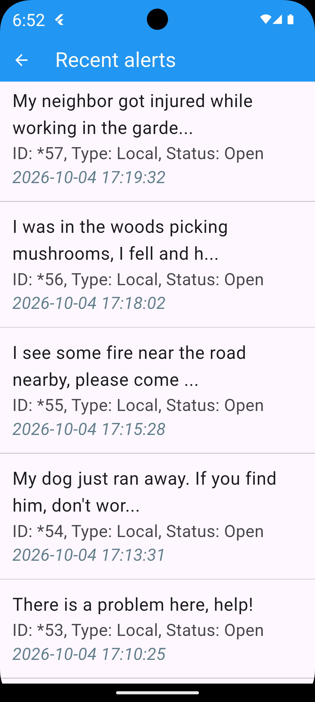

## Change password

If the user is unable to log in because they forgot their password, it can be reset: simply click "Forgot Password" on the login page.

At this point, the user will be asked for their email address and will receive a verification code that must be entered on the next screen along with the new password you have chosen.

Don't rush to read and write this code: you have 10 minutes (so you can write it down on a piece of paper if you prefer) before entering it on the app's verification screen.

But be careful to write it down correctly, because after three incorrect attempts, the procedure will be blocked for 24 hours and you will have to try again the following day.

## Account cancellation

Regular users and chiefs can delete their accounts if they no longer wish to use the service: at the bottom of the Quidalert app home page, there's a button to request account deletion. Simply type "DELETE" and click OK. Deletion isn't immediate; it takes 30 days. If the user logs in again within 30 days, the deletion will be instantly reversed (the account will remain active).

After 30 days, the account will be inactivated and can no longer be used (unless a new account is created).

The user will remain technically stored in the database (the email address will remain stored), but their personal data will be anonymized.

After 2 years, all traces of the user will be deleted from the database, including the email address used to authorize registration.

## Panel dedicated to admins and officers

Tutorial under construction...
