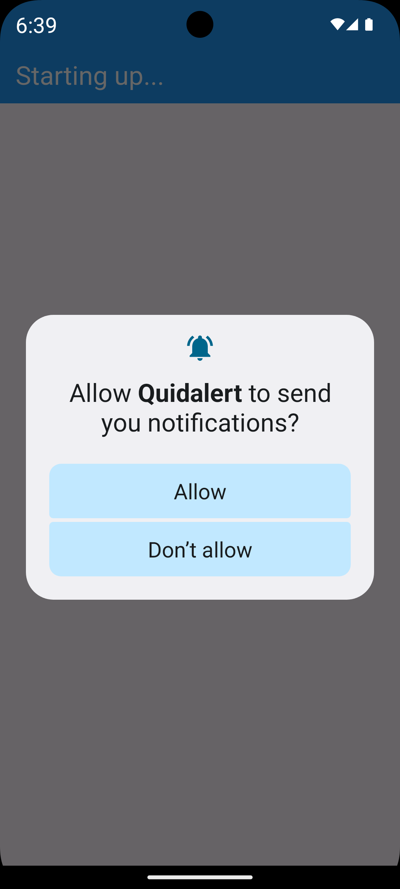
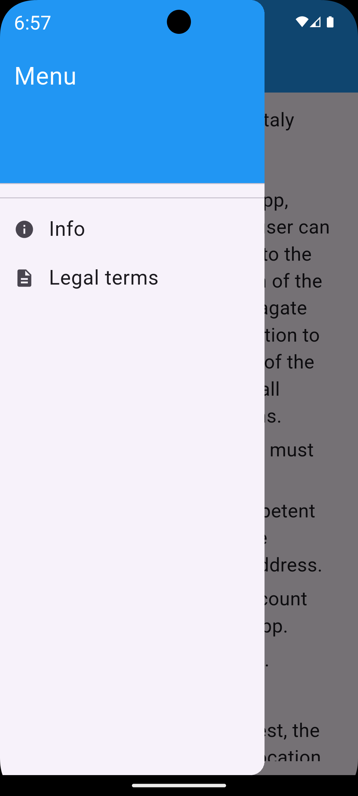
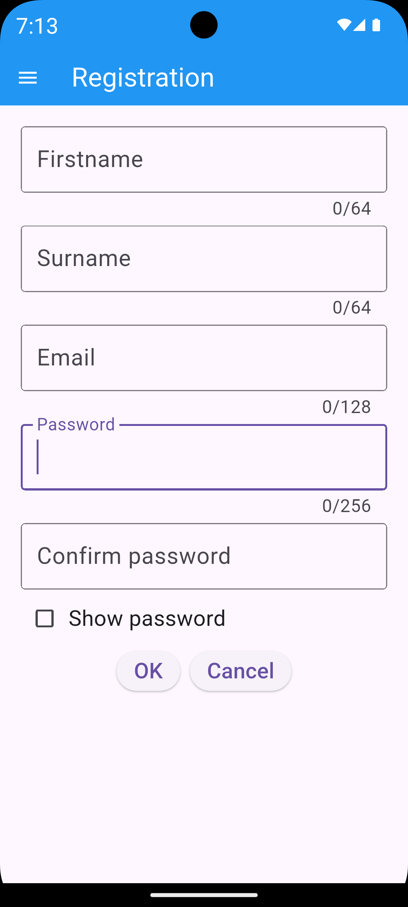
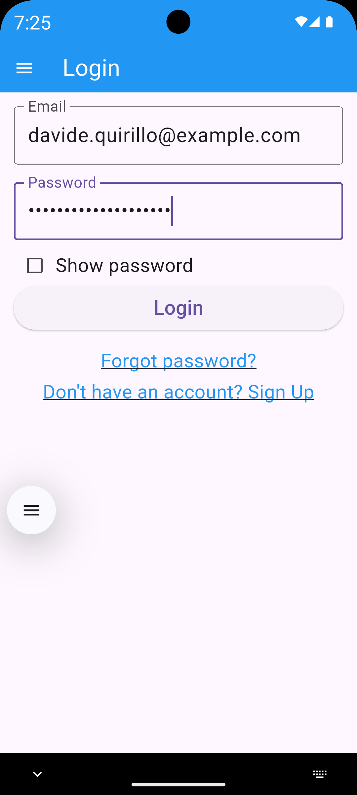

# Client usage tutorial

## Start application

When you first start the app, it asks for permission to send notifications.

  

This permission must be allowed because alerts sent to the server are propagated to the "chief" and nearby users who are notifiable (device registered to accept notifications), so this permission is essential. Press to "Allow".

The general information page will open. Read it carefully, as it contains useful details on how the system works and what you need to do to use it.

At the bottom of the page, you can click on "Legal Terms": this will open a page containing the terms and conditions of use, which you will need to accept after reading it.

NOTE: The same page can be reached by clicking on the menu at the top left.

  

After accepting the legal terms, the login page will open. To log in, you must be registered (have an account on the server), so click on the "Don't have an account? Sign up" link.

## Registration

Registration has one requirement, as explained on the "Info" page: the user's email address must have been authorized by the administrator or official user, i.e. it must have been included in a white list, so make sure you have obtained this authorization.

Registration is simple: simply fill out the short form (first name, last name, email address, password). You must set a strong password, containing at least one uppercase character, one lowercase character, a symbol, and a number, and it must be sufficiently long.

  

Once you confirm your registration, an activation link will be sent to your email inbox. You must open the email and click on the activation link to complete the registration, so your account will be activated and you can do login.

NOTE: the activation link received by email expires after 24 hours. After this time, you will need to repeat the registration process and receive a new activation link.

## Login and 2FA

The login page can be reached from the "Info" page or from the menu (top left button).

You must enter the email address and password you chose during registration. The password can be clearly displayed as you type it for your convenience by enabling the appropriate checkbox.

  

To be continued... Under construction...

## For admins

Under construction...